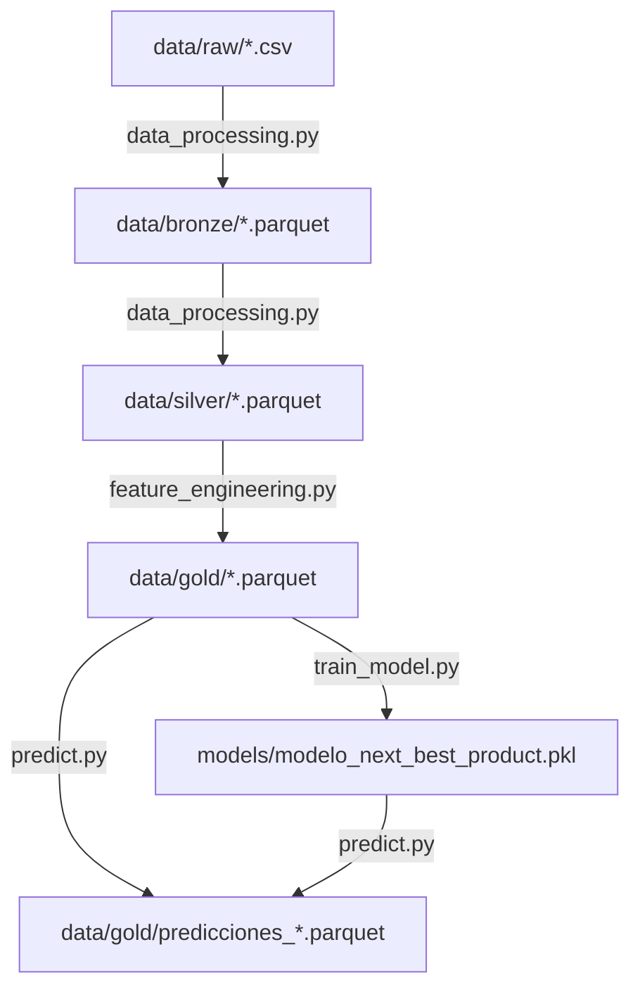

# Recomendador Predictivo de Productos Financieros: "Next Best Product"

Este repositorio contiene la solución completa de ingeniería de datos y modelado predictivo para implementar un recomendador bancario de "Mejor Siguiente Producto" (Next Best Product).

El sistema procesa la información de transacciones y tenencias de clientes mediante una arquitectura de datos Medallón (Raw $\rightarrow$ Bronze $\rightarrow$ Silver $\rightarrow$ Gold) y entrena un modelo predictivo supervisado basado en Random Forest. Adicionalmente, incluye un servidor **MCP (Model Context Protocol)** para interactuar con los resultados desde asistentes de IA y un stack de **Observabilidad (Grafana + Loki + Mimir + Tempo)** en producción.

---

## 1. Arquitectura de Datos Medallón

El flujo de procesamiento relacional se realiza en memoria mediante **DuckDB**, garantizando velocidades OLAP en milisegundos:

1. **Capa Raw**: Archivos originales de entrada en formato CSV localizados en `data/raw/`.
2. **Capa Bronze**: Conversión directa 1:1 de los archivos CSV a binarios estructurados en formato columnar **Parquet** (`data/bronze/`). Preserva metadatos y acelera las lecturas secuenciales.
3. **Capa Silver**: Limpieza, estandarización de tipos, imputación de nulos (edad y renta) usando la mediana para evitar sesgos, y cálculo Month-over-Month (MoM) de altas netas de productos financieros (`data/silver/`).
4. **Capa Gold**: Matriz de candidatos cruzando clientes y productos (excluyendo los productos que el cliente ya posee activamente para evitar ofertas redundantes), creación de variables agregadas de tenencia por categoría (ahorro, inversión, seguros, crédito) y **nuevos ratios de diversificación de portafolio** (`ratio_tenencia_ahorro`, `ratio_tenencia_credito`), y simulación reproducible de conversiones bancarias (`data/gold/`).

---

## 2. Estructura del Repositorio

```
Proyecto/
├── data/
│   ├── raw/         # CSVs originales de insumo
│   ├── bronze/      # Parquets de ingesta 1:1
│   ├── silver/      # Parquets limpios, tipados y con altas MoM
│   └── gold/        # Matriz analítica de candidatos y recomendaciones
├── notebooks/
│   ├── 01_ingesta_raw.ipynb
│   ├── 02_convertir_bronze.ipynb
│   ├── 03_limpieza_silver.ipynb
│   ├── 04_construccion_gold.ipynb
│   ├── 05_entrenamiento_modelo.ipynb
│   └── 06_prediccion_recomendacion.ipynb
├── src/
│   ├── data_processing.py      # Flujo Raw -> Bronze -> Silver (con Logging y Métricas)
│   ├── feature_engineering.py   # Flujo Silver -> Gold (con Ratios Predictivos)
│   ├── train_model.py          # Entrenamiento, tuning y métricas (con Feature Importance)
│   ├── predict.py              # Inferencia y generación de recomendaciones Top-1
│   └── mcp_server.py           # Servidor de integración MCP y métricas Prometheus (puerto 8000)
├── models/
│   ├── modelo_next_best_product.pkl   # Pipeline de inferencia Scikit-Learn
│   ├── metrics.json                   # Métricas finales del recomendador y variables importantes
│   └── pipeline_metrics.json          # Métricas de ejecución del pipeline de datos
├── docs/
│   ├── diccionario_datos.md    # Explicación de esquemas, relaciones y nuevas variables
│   ├── informe_modelo.md       # Reporte técnico de modelado y explicabilidad (Feature Importance)
│   ├── guia_ejecucion_clonado.md # Guía paso a paso para Windows, macOS y Linux
│   └── guion_presentacion_comercial.md # Guión nemotécnico comercial de venta
├── observability/
│   ├── docker-compose.yml      # Definición de Grafana, Loki, Mimir, Tempo y Alloy
│   ├── alloy/
│   │   └── config.alloy        # Configuración de raspado de logs y métricas MCP
│   └── grafana/
│       ├── provisioning/       # Aprovisionamiento de Datasources y Dashboards
│       └── dashboards/
│           └── next-best-product-dashboard.json # Dashboard preconfigurado de Grafana
├── logs/                       # Archivos de logs generados en caliente
│   ├── pipeline.log            # Logs de ejecución del flujo de datos
│   └── mcp.log                 # Logs de peticiones al Servidor MCP
├── requirements.txt            # Dependencias del entorno virtual
└── README.md                   # Esta guía
```

---

## 3. Detalle del Pipeline de Ejecución Analítica

El pipeline de datos está diseñado bajo el patrón Medallón y se ejecuta de forma secuencial. A continuación se detalla cada componente de la tubería, sus entradas, transformaciones, salidas y mecanismos de registro:



### Paso 1: Ingesta, Calidad y Estandarización
* **Script**: `src/data_processing.py`
* **Entradas**: Archivos CSV en `data/raw/` (`clientes.csv`, `productos.csv`, `cliente_estado_mensual.csv`, `cliente_producto_mensual.csv`, `provincias.csv`, `segmentos.csv`).
* **Procesamiento**:
  1. **Fase Bronze**: Conversión directa 1:1 a formato Parquet para optimizar almacenamiento y velocidad.
  2. **Fase Silver**: Limpieza, casteo de tipos de datos y control de calidad. Imputa valores faltantes en `edad` y `renta` mediante la mediana para neutralizar sesgos. Calcula las altas netas mensuales (altas de producto) basándose en la regla `estado_producto(t-1) == 0` y `estado_producto(t) == 1`.
* **Salidas**: Parquets optimizados en `data/silver/`.
* **Logs y Monitoreo**: Escribe trazas en `logs/pipeline.log` y exporta la cantidad de registros procesados a `models/pipeline_metrics.json`.

### Paso 2: Creación de la Matriz Analítica y Variables Predictivas (Features)
* **Script**: `src/feature_engineering.py`
* **Entradas**: Archivos Parquet de la capa Silver (`data/silver/`).
* **Procesamiento**:
  1. **Fase Gold**: Agrega temporalmente los productos poseídos por cliente/mes.
  2. **Cálculo de Ratios**: Genera dos nuevas variables predictivas:
     * `ratio_tenencia_ahorro`: Proporción de productos de ahorro/cuenta que posee el cliente respecto al catálogo total.
     * `ratio_tenencia_credito`: Proporción de productos de crédito que posee el cliente respecto al catálogo total.
  3. **Matriz de Candidatos**: Genera un producto cartesiano de clientes y productos, excluyendo aquellos productos activos que el cliente ya posee (evitando ofrecer productos repetidos).
  4. **Simulación de Conversión**: Calcula la variable objetivo `y` mediante una lógica reproducible.
* **Salidas**: 
  * `data/gold/dataset_next_best_product_gold.parquet` (Completo).
  * `data/gold/dataset_entrenamiento_nbp.parquet` (Subconjunto Train, sin tenencias activas).
  * `data/gold/dataset_prediccion_nbp.parquet` (Subconjunto Test, sin tenencias activas).
* **Logs y Monitoreo**: Registra el número de filas de entrenamiento y prueba generadas en `models/pipeline_metrics.json` y trazas de tiempo en `logs/pipeline.log`.

### Paso 3: Entrenamiento y Optimización del Modelo
* **Script**: `src/train_model.py`
* **Entradas**: `data/gold/dataset_entrenamiento_nbp.parquet`
* **Procesamiento**:
  1. **Preprocesador (ColumnTransformer)**: Normaliza variables numéricas (StandardScaler) y codifica variables categóricas (OneHotEncoder, configurado con `handle_unknown='ignore'`).
  2. **Entrenamiento**: Ajusta un clasificador **Random Forest** mediante validación cruzada segmentada por cliente (Group Split, 80/20) para evitar data leakage.
  3. **Optimización (Tuning Layer)**: Realiza tuning de hiperparámetros (`RandomizedSearchCV`).
  4. **Explicabilidad (Feature Importance)**: Extrae de forma nativa la importancia media de impureza de Gini de las variables predictivas y selecciona las 5 más influyentes.
* **Salidas**:
  * Modelo serializado: `models/modelo_next_best_product.pkl`
  * Métricas de evaluación y feature importance: `models/metrics.json`
* **Logs y Monitoreo**: Escribe métricas en `logs/pipeline.log` y actualiza automáticamente los Gauges de Prometheus si el servidor MCP está levantado.

### Paso 4: Inferencia y Generación de Recomendaciones Top-1
* **Script**: `src/predict.py`
* **Entradas**: `data/gold/dataset_prediccion_nbp.parquet` y `models/modelo_next_best_product.pkl`
* **Procesamiento**:
  1. Carga el pipeline de inferencia y ejecuta la estimación de probabilidades sobre los pares (cliente, candidato).
  2. Agrupa por cliente y genera un ranking jerárquico descendente (`ranking_producto`) según la probabilidad de adquisición.
  3. Extrae la recomendación ideal (rango 1) para cada cliente.
* **Salidas**:
  * `data/gold/predicciones_next_best_product.parquet` (Predicciones completas ordenadas).
  * `data/gold/recomendaciones_next_best_product.parquet` (Recomendación Top-1 para uso comercial).
* **Logs y Monitoreo**: Registra tiempos de ejecución en `logs/pipeline.log` y actualiza `models/pipeline_metrics.json`.

---

## 4. Guía de Ejecución Rápida

Para ejecutar de manera automatizada todo el pipeline secuencial desde consola, activa tu entorno virtual `.venv` y ejecuta:

```bash
# Ejecutar la secuencia del pipeline analítico de extremo a extremo
python src/data_processing.py && \
python src/feature_engineering.py && \
python src/train_model.py && \
python src/predict.py
```

*Nota: Alternativamente, puedes abrir e interactuar directamente con los notebooks de Jupyter en `notebooks/` del `01` al `06` en orden, ya que se encuentran completamente ejecutados e in-place.*

---

## 4. Servidor MCP y Exposición de Métricas

El servidor MCP conecta de forma segura tu modelo analítico y datos con asistentes de Inteligencia Artificial (ej. Gemini o Claude):

* **Puerto de Métricas Prometheus:** `http://localhost:8000/metrics` (expone automáticamente los resultados del último entrenamiento, volumen del pipeline y llamadas del MCP).
* **Herramientas Expuestas:**
  * `get_client_profile(client_id)`: Retorna datos demográficos e historial de tenencias del cliente.
  * `get_client_recommendation(client_id)`: Retorna la sugerencia del Random Forest y su probabilidad.
  * `get_model_performance()`: Retorna métricas del modelo (AUC, Acc@1, Acc@3).
  * `get_model_explainability()`: Retorna las 5 variables que más influyen en el modelo.
  * `get_product_catalog()`: Retorna la lista de productos del banco.
* **Prompts Expuestos:**
  * `preparar_briefing_comercial(client_id)`: Genera un sales pitch automatizado e hiper-personalizado redactado por IA.

Para iniciar el servidor:
```bash
python src/mcp_server.py
```

---

## 5. Monitoreo y Observabilidad (Grafana Stack)

Para levantar el entorno completo de monitoreo (Docker Requerido):

```bash
cd observability
docker compose up -d
```

Abre tu navegador e ingresa a **Grafana**: `http://localhost:3000` (Usuario: `admin` | Clave: `admin123`).
Ingresa a **Dashboards** -> **Next Best Product - ML & Ingestion Observability** para ver:
* Indicadores visuales de precisión y latencia del recomendador.
* Visor de logs dinámico (Loki) sincronizado para los archivos de logs de `logs/`.
* Métricas de uso de la IA interactuando con tu servidor MCP en tiempo real.
