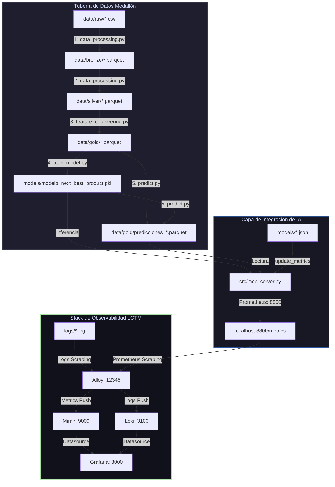

# Checklist de Despliegue y Ejecución del Flujo Completo (Next Best Product)

Este checklist ha sido elaborado siguiendo los lineamientos de la directiva de despliegue para garantizar una transición segura, controlada y sin fallos del pipeline predictivo **Next Best Product (NBP)** y su stack de observabilidad de Staging a Producción.

---

## 🗺️ Mapa del Flujo de Ejecución Completo

El siguiente diagrama ilustra la secuencia de ejecución de los componentes analíticos de datos y la recolección paralela de telemetría en el stack de observabilidad:



---

## 📋 Checklist de Despliegue de Extremo a Extremo

### 1. Verificaciones Previas al Despliegue (Pre-flight Checks)
- [ ] **Consistencia de Rama:** Validar que nos encontramos en la rama de despliegue estable (`aagrandaz-01`) y que todos los cambios locales están limpios y empujados (`git status`).
- [ ] **Entorno Virtual Activo:** El entorno virtual de Python `.venv` está correctamente creado y activado en el host.
- [ ] **Dependencias Instaladas:** Las dependencias del entorno coinciden exactamente con el archivo de requerimientos (`pip install -r requirements.txt`).
- [ ] **Variables de Entorno:** Las variables del sistema (`GRAFANA_ADMIN_USER`, `GRAFANA_ADMIN_PASSWORD`) están definidas en el entorno o en un archivo `.env` en la raíz.
- [ ] **Exclusiones de Seguridad:** Validar que las carpetas `.venv/` y `.agent/` se encuentran dentro del archivo `.gitignore` para no subir librerías ni epígrafes analíticos de IA al repositorio central.

### 2. Ejecución y Validación de la Tubería Analítica (Pipeline)
*El operador debe elegir **una de las dos alternativas siguientes** para generar la data limpia y entrenar el modelo (ambas opciones son mutuamente excluyentes y redundantes entre sí):*

* **Alternativa A: Ejecución Directa mediante Scripts Python (Terminal)**
  Ejecutar la secuencia de modelado analítico mediante la terminal activa en la raíz del proyecto:
  ```bash
  python src/data_processing.py && \
  python src/feature_engineering.py && \
  python src/train_model.py && \
  python src/predict.py
  ```

* **Alternativa B: Ejecución Interactiva mediante Notebooks de Jupyter**
  Abrir e iniciar secuencialmente todas las celdas de los cuadernos ubicados en `notebooks/` en el orden indicado:
  1. `01_ingesta_raw.ipynb`
  2. `02_convertir_bronze.ipynb`
  3. `03_limpieza_silver.ipynb`
  4. `04_construccion_gold.ipynb`
  5. `05_entrenamiento_modelo.ipynb`
  6. `06_prediccion_recomendacion.ipynb`

- [ ] **Sin Errores en la Ejecución:** La alternativa seleccionada (scripts o notebooks) finaliza sin excepciones de Python o DuckDB.
- [ ] **Escribiendo Logs:** El archivo de registro `logs/pipeline.log` se genera activamente y reporta los logs en caliente para cada capa (Bronze, Silver, Gold, ML, Inferencia).
- [ ] **Métricas del Pipeline Actualizadas:** El archivo `models/pipeline_metrics.json` existe y reporta números de filas de datos procesadas consistentes (ej. Bronze: ~20K, Silver: ~2K, Gold Train: ~14.9K).
- [ ] **Modelo y Evaluación Listos:** Se generan los archivos `models/modelo_next_best_product.pkl` (modelo serializado) y `models/metrics.json` con un ROC-AUC aceptable (>75%) y Accuracy@1/Accuracy@3 correspondientes.

### 3. Arranque del Servidor de Integración (MCP Server)
Levantar el servidor MCP de Python en segundo plano:
```bash
python src/mcp_server.py
```
- [ ] **Puerto Abierto:** Verificar que el puerto `8800` de Prometheus se encuentre a la escucha en el host.
- [ ] **Salida de Métricas Correcta:** Ejecutar `curl -s http://localhost:8800/metrics` y constatar la presencia de métricas analíticas e importancias (`nbp_model_feature_importance{feature="renta"}`).
- [ ] **Logs de MCP Activos:** El archivo `logs/mcp.log` se inicializa y registra el arranque y las actualizaciones de métricas en disco.

### 4. Levantamiento y Monitoreo del Stack de Observabilidad
Levantar la infraestructura de contenedores desde la carpeta de observabilidad:
```bash
cd observability
docker compose up -d
```
- [ ] **Contenedores Saludables:** Verificar con `docker compose ps` que los 5 contenedores (`nbp-alloy`, `nbp-loki`, `nbp-mimir`, `nbp-tempo` y `nbp-grafana`) muestren estado `Up` y `healthy`.
- [ ] **Alloy Conectado:** Inspeccionar la interfaz de Grafana Alloy en `http://localhost:12345` y corroborar que los componentes de scraping (`prometheus.scrape.mcp_server` y `local.file_match.proyecto_logs`) estén en estado "Healthy" (verde) enviando datos a Loki y Mimir.
- [ ] **Acceso a Grafana:** Ingresar a `http://localhost:3000` con las credenciales de administración correspondientes.
- [ ] **Dashboard Aprovisionado:** Cargar el dashboard **Next Best Product - ML & Ingestion Observability** y corroborar que:
  - No existan paneles con errores visuales o leyendas de "No Data".
  - El banner superior HTML/CSS se dibuje con estilo metálico oscuro y neon.
  - Los 3 Gauges de Machine Learning (AUC, Accuracy@1, Accuracy@3) y las barras de Feature Importance muestren los valores del último entrenamiento.
  - El visor de Logs (Loki) liste de forma descendente los mensajes de `pipeline.log` y `mcp.log`.

### 5. Verificaciones y Tareas Post-Despliegue
- [ ] **Prueba de Invocación de Herramientas:** Consumir una herramienta del MCP (ej. `get_client_recommendation` o `get_model_explainability`) usando un cliente de MCP y validar en Grafana que el panel de llamadas e incrementos refleje la invocación de inmediato.
- [ ] **Cierre de Cambios en Git:** Realizar commit con todas las firmas requeridas y empujar a producción en la rama definitiva tras la aprobación humana.
- [ ] **Plan de Rollback Listo:** Tener pre-redactada la sentencia de reversión rápida ante fallos imprevistos:
  ```bash
  # Comando de Rollback Inmediato (Git revert + Reinicio de Contenedores)
  git reset --hard HEAD~1 && docker compose -f observability/docker-compose.yml restart
  ```
