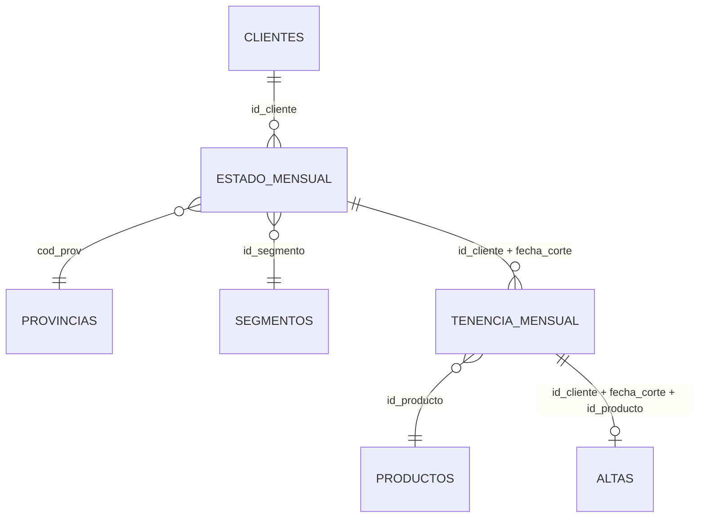

# Diccionario de Datos y Relaciones: Recomendador "Next Best Product"

Este documento describe la estructura, tipos de datos y relaciones de los archivos de datos normalizados del modelo analítico.

---

## 1. clientes.csv (Maestro de Clientes)
* **Propósito**: Tabla maestra de clientes. Contiene atributos estables del cliente e identifica si el cliente pertenece a los conjuntos de entrenamiento, prueba o ambos.
* **Granularidad**: Una fila por cliente.
* **Clave Primaria**: `id_cliente`

### Esquema de Columnas:
| Campo | Tipo Sugerido | Descripción | Uso Recomendado |
| :--- | :--- | :--- | :--- |
| `id_cliente` | Entero | Identificador único del cliente (proviene de `ncodpers`). | Clave de unión. |
| `ind_empleado` | Texto / Categórico | Indicador de si el cliente es empleado del banco. | Variable explicativa. |
| `pais_residencia` | Texto / Categórico | País de residencia del cliente. | Variable explicativa o filtro. |
| `sexo` | Texto / Categórico | Sexo registrado del cliente. | Variable explicativa. |
| `fecha_alta` | Fecha (`DATE`) | Fecha de ingreso del cliente al banco. | Para calcular antigüedad. |
| `conyuemp` | Texto / Categórico | Indicador de si el cónyuge del cliente es empleado del banco. | Variable opcional. |
| `canal_entrada` | Texto / Categórico | Canal por el que ingresó el cliente al banco. | Variable explicativa. |
| `indfall` | Texto / Categórico | Indicador de cliente fallecido (S/N). | Puede usarse como filtro. |
| `aparece_en_train` | Binario (`INTEGER`) | Vale 1 si el cliente aparece en el conjunto de entrenamiento original. | Control de datos. |
| `aparece_en_test` | Binario (`INTEGER`) | Vale 1 si el cliente aparece en el conjunto de prueba original. | Control de datos. |

---

## 2. provincias.csv (Catálogo de Provincias)
* **Propósito**: Catálogo normalizado para evitar redundancia del nombre de la provincia.
* **Granularidad**: Una fila por provincia.
* **Clave Primaria**: `cod_prov`

### Esquema de Columnas:
| Campo | Tipo Sugerido | Descripción | Uso Recomendado |
| :--- | :--- | :--- | :--- |
| `cod_prov` | Entero | Código de provincia del cliente. | Clave para unir con `cliente_estado_mensual`. |
| `nombre_provincia`| Texto / Categórico | Nombre de la provincia. | Variable geográfica interpretable. |

---

## 3. segmentos.csv (Catálogo de Segmentos Comerciales)
* **Propósito**: Catálogo normalizado de los segmentos de marketing o comerciales.
* **Granularidad**: Una fila por segmento.
* **Clave Primaria**: `id_segmento`

### Esquema de Columnas:
| Campo | Tipo Sugerido | Descripción | Uso Recomendado |
| :--- | :--- | :--- | :--- |
| `id_segmento` | Entero | Identificador único del segmento. | Clave para unir con `cliente_estado_mensual`. |
| `descripcion_segmento`| Texto / Categórico | Nombre o descripción del segmento de negocio (ej. Universitario, VIP). | Variable explicativa. |

---

## 4. productos.csv (Catálogo de Productos Financieros)
* **Propósito**: Catálogo normalizado de productos financieros que simplifica las columnas originales en una dimensión unificada.
* **Granularidad**: Una fila por producto financiero.
* **Clave Primaria**: `id_producto`

### Esquema de Columnas:
| Campo | Tipo Sugerido | Descripción | Uso Recomendado |
| :--- | :--- | :--- | :--- |
| `id_producto` | Entero | Identificador único de producto. | Clave para uniones de tenencia y altas. |
| `campo_original` | Texto | Nombre original de la columna en el dataset de origen (Santander). | Trazabilidad. |
| `nombre_producto` | Texto / Categórico | Nombre legible del producto financiero. | Interpretación de recomendaciones. |
| `categoria_producto`| Texto / Categórico | Categoría general del producto (Cuenta, Crédito, Tarjeta, Inversión). | Feature del producto candidato. |

---

## 5. cliente_estado_mensual.csv (Estado Mensual)
* **Propósito**: Registro histórico mensual del comportamiento financiero del cliente. Contiene variables demográficas y comerciales dinámicas.
* **Granularidad**: Una fila por cliente, fecha de corte y origen de datos.
* **Claves de Clave Primaria**: `id_cliente` + `fecha_corte` + `origen_datos`

### Esquema de Columnas:
| Campo | Tipo Sugerido | Descripción | Uso Recomendado |
| :--- | :--- | :--- | :--- |
| `id_cliente` | Entero | Identificador único del cliente. | Clave de unión. |
| `fecha_corte` | Fecha (`DATE`) | Fecha mensual de observación (último día del mes). | Referencia temporal. |
| `origen_datos` | Texto / Categórico | Indica si la fila pertenece al set de entrenamiento (`train`) o prueba (`test`). | Control de separación. |
| `es_test` | Binario (`INTEGER`) | Vale 1 si el origen de datos es `test`, 0 si es `train`. | Identificación rápida. |
| `age` | Entero | Edad del cliente en el mes observado (imputado por mediana si era nulo). | Variable numérica. |
| `antiguedad` | Entero | Antigüedad del cliente en meses en el banco. | Variable numérica. |
| `ind_nuevo` | Binario / Categórico | Indicador de si el cliente es registrado como nuevo. | Variable explicativa. |
| `indrel` | Categórico | Tipo de relación del cliente (1: Activo principal, 99: Temporal). | Variable explicativa. |
| `indrel_1mes` | Categórico | Estado de la relación al inicio del mes. | Variable explicativa. |
| `tiprel_1mes` | Categórico | Tipo de relación comercial al inicio del mes (A: Activa, I: Inactiva). | Variable explicativa. |
| `indresi` | Categórico | Indicador de residencia en el país (S/N). | Filtro. |
| `indext` | Categórico | Indicador de nacionalidad extranjera (S/N). | Variable explicativa. |
| `ind_actividad_cliente`| Binario / Categórico | Indica si el cliente realizó transacciones en el mes (1/0). | Variable explicativa crítica. |
| `renta` | Numérico | Renta o ingreso estimado (imputado por mediana de la población si era nulo). | Variable numérica. |
| `cod_prov` | Entero | Código de provincia. | Clave para catálogo de provincias. |
| `id_segmento` | Entero | Identificador de segmento (por defecto -1 si es nulo). | Clave para catálogo de segmentos. |

---

## 6. cliente_producto_mensual.csv (Tenencia Mensual de Productos)
* **Propósito**: Relación histórica mensual que indica si un cliente tiene activo un producto financiero específico.
* **Granularidad**: Una fila por cliente, fecha de corte, origen de datos y producto.
* **Claves de Clave Primaria**: `id_cliente` + `fecha_corte` + `origen_datos` + `id_producto`

### Esquema de Columnas:
| Campo | Tipo Sugerido | Descripción | Uso Recomendado |
| :--- | :--- | :--- | :--- |
| `id_cliente` | Entero | Identificador del cliente. | Clave de unión. |
| `fecha_corte` | Fecha (`DATE`) | Fecha del mes observado. | Referencia temporal. |
| `origen_datos` | Texto | Origen de datos (`train` o `test`). | Separación. |
| `id_producto` | Entero | Identificador del producto financiero. | Clave de unión con catálogo. |
| `estado_producto` | Binario (`INTEGER`) | Vale 1 si el cliente tiene activo el producto, 0 de lo contrario. | Feature del historial. |

---

## 7. cliente_producto_alta.csv (Eventos de Adquisición)
* **Propósito**: Identifica las adquisiciones efectivas de productos nuevos en el mes (altas de producto).
* **Regla de Negocio**: Un alta ocurre cuando `estado_producto(t - 1) == 0` y `estado_producto(t) == 1`.
* **Granularidad**: Una fila por cliente, fecha de corte, origen de datos y producto adquirido.

### Esquema de Columnas:
| Campo | Tipo Sugerido | Descripción | Uso Recomendado |
| :--- | :--- | :--- | :--- |
| `id_cliente` | Entero | Identificador del cliente. | Clave de unión. |
| `fecha_corte` | Fecha (`DATE`) | Mes en el que se detecta la adquisición. | Evento objetivo temporal. |
| `origen_datos` | Texto | Origen de datos (`train` o `test`). | Separación. |
| `id_producto` | Entero | Identificador del producto adquirido. | Catálogo de productos. |
| `flag_alta_producto`| Binario (`INTEGER`) | Vale 1, indicando la compra neta de ese producto en ese periodo. | Target positivo. |

---

## 8. Relaciones entre Entidades

El siguiente esquema resume cómo se integran las tablas para la construcción del dataset final en la capa Gold:

---

## 9. Matriz Analítica Gold (`dataset_next_best_product_gold.parquet`)
* **Propósito**: Matriz final construida cruzando clientes y productos candidatos (excluyendo tenencias vigentes) utilizada para entrenamiento e inferencia.
* **Granularidad**: Una fila por cliente, fecha de corte, origen de datos y producto candidato.

### Esquema de Variables Adicionales:
| Campo | Tipo | Descripción | Uso Recomendado |
| :--- | :--- | :--- | :--- |
| `ratio_tenencia_ahorro` | Flotante | Proporción de productos de categoría 'Ahorro' y 'Cuenta' que el cliente posee respecto al total de esas categorías en el catálogo. | Variable numérica explicativa. |
| `ratio_tenencia_credito` | Flotante | Proporción de productos de categoría 'Crédito' que el cliente posee (activo/inactivo). | Variable numérica explicativa. |
| `y` | Binario (`INTEGER`) | Target simulado de propensión (1: adquiere producto, 0: no adquiere). | Variable objetivo para el modelo. |

